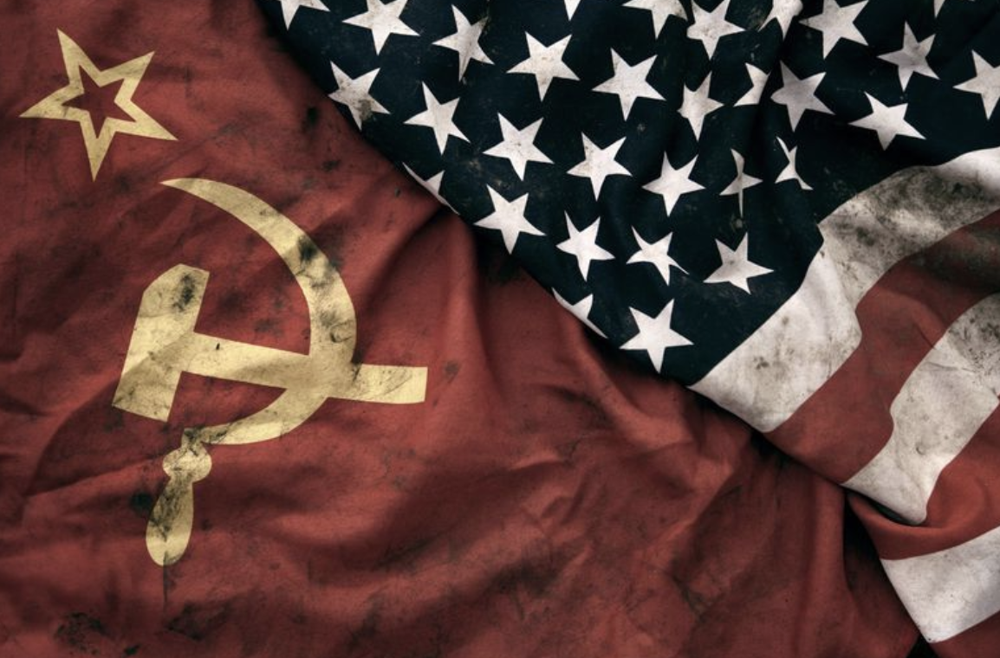
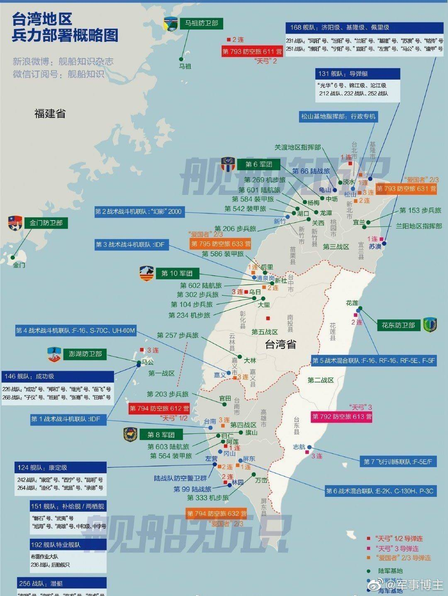
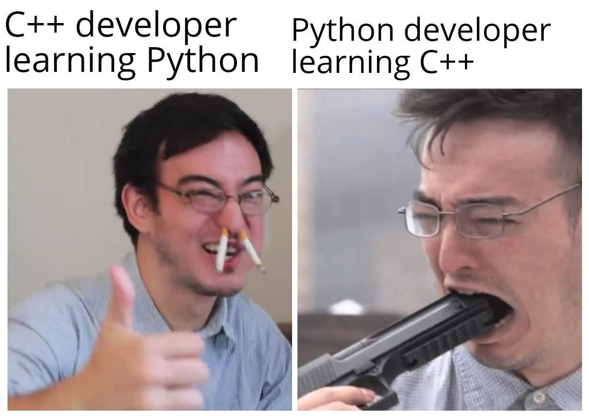
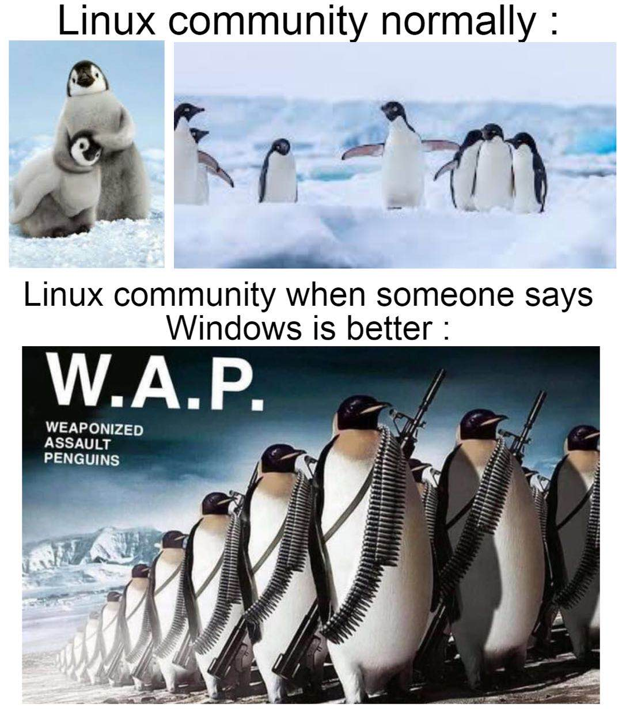
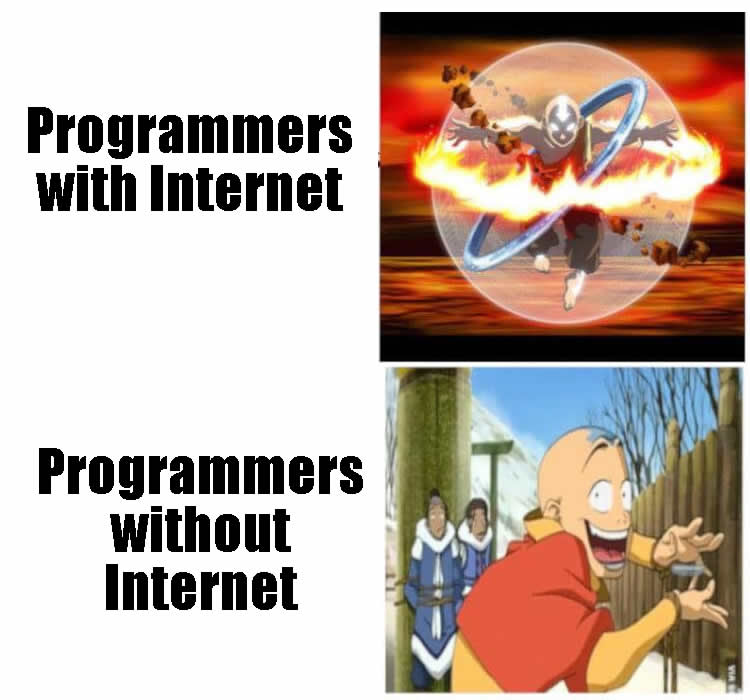

# 真科技周刊第一期：开源也是一场“共产主义”运动

<bold>20201019封面图</bold>

开源也是一场“共产主义”运动

### Hacker Fact

#### 外来食物中的 胡 藩 洋

我们称呼外来食物常用三个字胡、藩、洋，各有指向。胡是汉朝通过丝绸之路传入，比如胡椒。藩是从唐到明朝时传入，比如番茄。洋用来形容清朝通过海上丝路传入的食物，比如 洋葱。这不仅是称呼的改变，更代表着中国对外交往方向和形式的变化，从陆路的北方蒙古草原到西面的西域各国，再到大海上的环球航行。

#### Google 的彩色边框是如何实现的？

通过不同颜色组成的方块的叠加，Google 轻松实现了多彩的边框

[Twitter](https://twitter.com/hanawa_hinata/status/1314394235613798400?s=21)

#### 现在，桌面上这些设备都可以装进你的口袋

#### 网络上流传的一张台湾军队部署图

#### 2001 vs 2020

### 文摘

#### 通往开源之路

如果把软件技术和知识看作是软件劳动者的生产资料的话，那么开源正是打破了软件巨头垄断，让生产资料真正掌握在劳动者的手里。因此，从某种意义上说，开源也是一场“共产主义”运动

[通往开源之路](https://mp.weixin.qq.com/s/M7kohg-PCP0N_2I-Go1JVg)

#### 美国从未放弃制造业

一百多年前美国有一个物理学家叫做亨利·罗兰，做过一次演讲，他说假如我们停止科学的进步而只留意科学的应用，很快就会退化成中国人那样。多少代人以来，中国人都没有什么进步，因为他们只满足科学应用，却从来没有追问过他们所做事情的原理。

[美国从未放弃制造业](https://finance.sina.cn/china/gncj/2020-09-18/detail-iivhuipp5079056.d.html?from=wap)

#### 对话逍遥子：阿里巴巴的“刚”、“柔” 和 “勇”

对聪明人来说，建立商业认知、理解商业本质并不难，难的是从本质出发提炼出商业策略和打法，并在实践中保持战略定力

第一个是没有完美的决定，第二是对于一号位来讲，最重要的工作就是在合适的时间，果断做决定，也许无论向南和向北，最终走向的都是罗马。但是你必须走一个方向。最怕你向南走了，走了一百公里，觉得苗头不太对，赶紧转身向北走，走着走着又要回头。

[阿里巴巴的“刚”、“柔” 和 “勇”](https://mp.weixin.qq.com/s/UPN1UgeX2zRI-cZBvpdUBQ)

#### 互联网公司的两万人陷阱

2万人，相当于部队的集团军编制了吧。一般企业都到团一个级别的规模就很难再扩展了。集团军的作战目标是需要有战略方向与大规模多兵种协同组织的。团一级仍然是战役目标为主，这个应该和连营作战目标的本质没有区别。团长如何进步到能指挥好一个军以上的队伍也是不容易的。因此只要是组织管理，到万人以上规模，目标，方法都完全不同了。还要百战百胜，真难！

[互联网公司的两万人陷阱](https://mp.weixin.qq.com/s/pPXjiSjN58R4MOoWg5xrYw)

### 书摘

#### 《野心优雅》：地主什么时候买地？

地主之所以能成为地主，从经济学的角度看，绝不会是在农业丰收的年景去收购土地而成为地主。因为丰收的年景中农民并不缺粮，当然也用不着卖地，如果一定有人要买丰年的土地，那么农民也会按丰年的产出估了高价，那也就没人会去买了。

地主一定会在灾年收购农民的土地，一是灾年农民没了存粮，不得不用土地去换取粮食渡过难关，活下去至少还有生存的希望，如果宁可饿死也不卖地，那么地又有什么用呢？二是灾年土地的价格低，只能以灾年的产量来估值。因此灾年是地主购买土地的好时机。但地主靠什么在灾年还能购买土地呢？那就是靠存粮，有充足的粮食渡过灾年，并有充足的粮食可以用于交换土地，还要充足到有能力进行下一年的生产投入和等到获得下一年的收成。如果不能形成这样一种有足够能力的循环，那么地主也会饿死。

#### 《闪电式扩张》：从海盗到海军

海军陆战队攻下海滩，军队占领国家，警察治理国家。海军陆战队员好比初创企业的员工，他们习惯于在现场处理混乱情况和临时应变。陆军士兵好比规模化企业的员工，他们知道部队离开海滩后该如何快速占领并守护领土。警察好比稳定企业的员工，他们的工作是维持秩序而不是破坏秩序。海军陆战队和军队通常可以合作，军队和警察通常也可以合作，但海军陆战队和警察很少有默契合作。当你进行闪电式扩张时，可能需要为海军陆战队寻找需要攻占的新海滩，而不是让他们帮助巡逻现有海滩。

### Hacker 段子

##### C++开发者学习Python VS Python 开发者学习 C++

##### 日常的 Linux 社区 VS 有人说 Windows 系统更好的 Linux 社区

##### 有网时的开发者 VS 无网时的开发者

