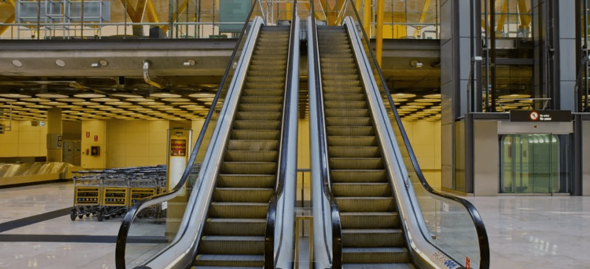
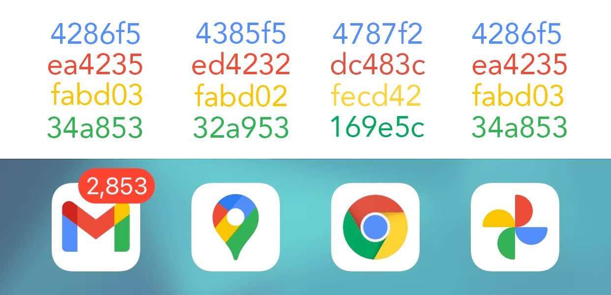
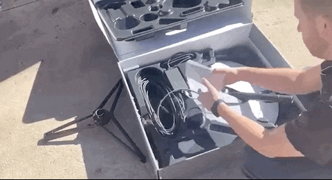
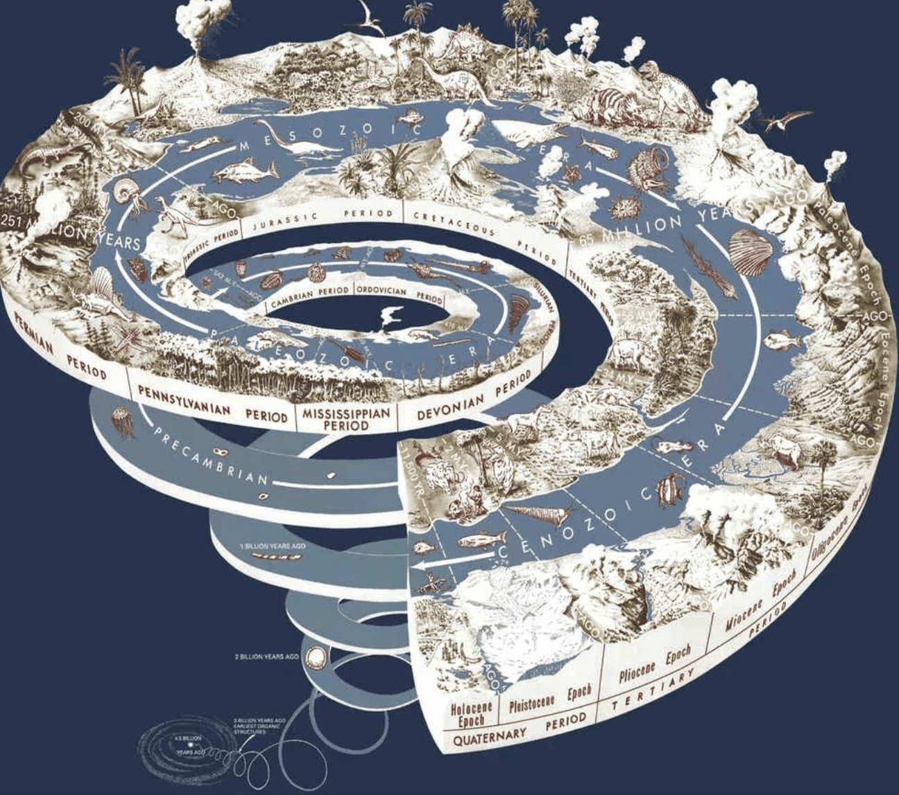
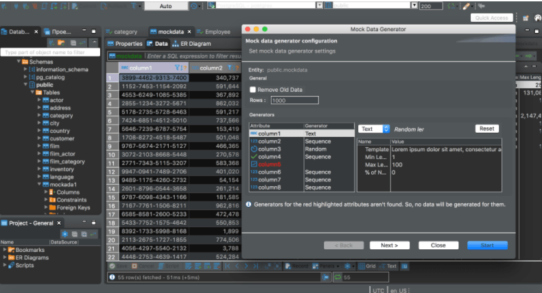
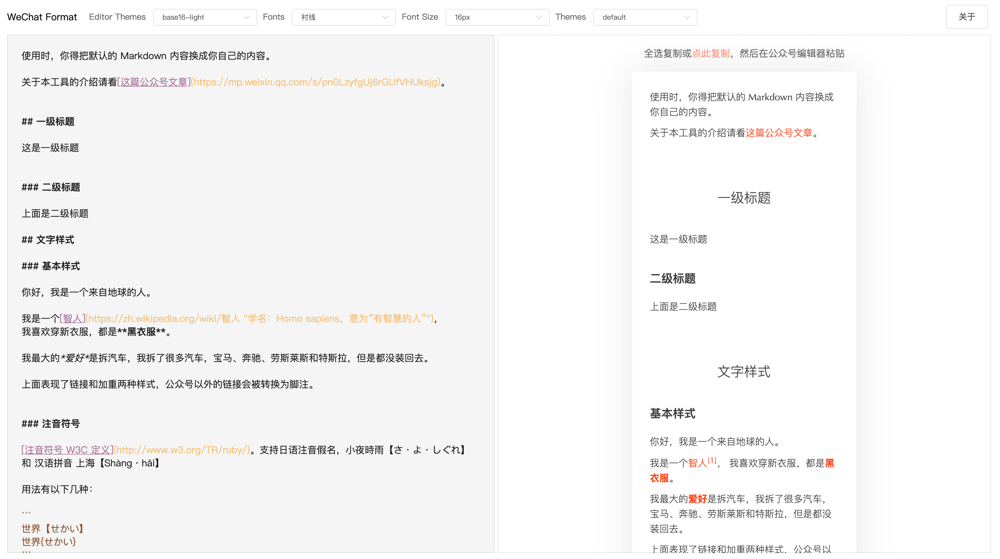

# 成为世界霸权的三个条件 — 真科技周刊第三期

### 为什么电梯扶手比台阶快？

相信大多数人总有这样的经历：踏上电扶梯，手放在扶手上，感觉扶手的履带比踏板要快一些。因为自己本来与身体平行的手，慢慢不再与身体平行，而是移动到了很靠前的位置。

如果乘客手握扶手时，扶手带速度低于梯级或踏板的速度，容易造成人体后仰而发生意外事故。因为人的手臂的生理结构导致手向后移动时会锁住关节，使得手无法及时松开扶手，进而带动乘客后仰跌倒。

而且，刚踏上电梯和刚离开电梯的时候往往是乘客最不容易保持平衡的时候，很容易摔倒。

扶手带速度比梯级速度稍微大一些，能稳住乘客的同时把身体重心往前带，避免乘客的身体因速度的突然增大而后仰摔倒。比如乘客刚踏上电梯，扶手带能够迅速提升乘客的前进速度，使之与梯级速度保持一致，维持身体重心的稳定。

[轻草集](https://mp.weixin.qq.com/s?__biz=MzIxNTYyOTk1Nw==&mid=2247483693&idx=1&sn=0b3ab8f98b361a38d0d1e16d9e28f92a&chksm=979428c7a0e3a1d1b82d705051a935d0c79e5998045c40a7dde83c42f4a0649f954baa6bc023&token=1551347876&lang=zh_CN#rd)

### 对蚂蚁集团的思考

1、相关监管文件不可能是最近才制定的。很可能是半年，甚至1-2年前就开始酝酿的，在酝酿的过程中，国内的互联网金融巨头都是全程知晓并参与其中的。

2、马云的演讲和几大部门的监管，置气或者发泄情绪为主要目的的概率很低。马云的演讲，肯定不可能是他自己的手笔，背后有相关创作团队。在演讲之前，蚂蚁应该大致了解相关监管文件可能要在近期推出，所以讲话讨价还价的意味很浓。

3、通过这次监管，蚂蚁得到了他想要的东西。主要有：1）通过四部委的联合监管，完全认证了蚂蚁是一家金融机构。以后蚂蚁就是和全国性银行一样，统一受中国的金融系统监管。蚂蚁不再是所谓身份不明的“科技助贷机构”。蚂蚁可以正大光明的搞金融了。

2）通过此次监管，蚂蚁和其他竞争对手拉开了差距。30亿资本金放3万亿贷款的事情，不会再有。同时，市场再有其他竞争对手想崛起，不仅仅是资本金的问题，光是省内开展业务这个约束条件就要努力很久。而蚂蚁，因为存量的因素，不受上述限制。监管长期来看，保护了蚂蚁的既得利益，打击了拼多多、抖音等金融市场的后起之秀。蚂蚁未来的互联网金融的业务有了一定的垄断性。

3）整个互联网小贷市场很大。天花板也很大。蚂蚁作为先行者，优势会很明显。手握3万亿的贷款余额，资本金大概需要3000亿，只要能证明模式可行，募集满资本金，就算这个车票补上了。其他竞争对手一是没有上市，而是先要有资本金，再开展业务，这个募资难度不是一个数量级的。

3、监管层通过这次监管，也得到了他想要的：1）至少保证了市场上不会很快出现下一个蚂蚁，互联网小额贷款群体性风险得到控制。2）将蚂蚁、腾讯等既得利益者和还未完成布局但有实力的参与者区分开，一方面增加了他们之间的矛盾，一方面打破了原先铁板一块的局面，为分而治之打下基础。

4、蚂蚁已经确定是金融机构了，那么他的科技公司的估值基础是不是有问题？此次IPO一共才募资320亿美元，还不够存量业务的运行。可以想见，蚂蚁也会和银行一样，走上不停大规模抽血的老路。

### 套娃版 Google 旗下产品 LOGO

 最近 Google 对旗下 APP 的 ICON 做了一次改版，引起国外网友一顿热议。有人指出，这种一致的配色让人分不清不同的产品。近日，有twitter 网友对logo上的颜色进行测量后得出结论，其实 Google 给每个产品 Icon 的配色都是不一样的。

### Starlink 卫星互联网开箱视频 

Elon Musk 马斯克的 Starlink 在北美进行 Beta 测试，这几天已经有用户陆续收到测试套件，其中包括了卫星天线、天线支架、一个黑色的 Modem、一个白色的路由器 测试者都说速度超快！ via: Reddit Snowjunkie21

### 思想实验：你能否测量出单程光速

你是否知道：“光速”是如何被测量出来的？而人类又是基于什么想法，设计出测量光速的实验呢？

这是一个乍一想，好像有点头绪；但是仔细一琢磨，发现处处是玄机的问题。

这个视频探讨了很多尝试测量光速的方案，并且解析了它们的局限性。这会让你对这个宇宙中最重要的常量，有更深刻的理解

[中文视频](https://m.weibo.cn/detail/4567206782571317) [英文视频](https://www.youtube.com/watch?v=pTn6Ewhb27k)

### 我们正处在有史以来异常高风险的时代吗

我们该用什么样的词来形容当下身处的时代？你心里想的可能会是“史无前例”，或是“所向披靡”。

但在这里，我们用了一个你可能没怎么听过的词：“**结点**（hingey）”。

虽然这不是个特别有文艺美感的词，但它却描述了一个极具潜力和远见的想法：**我们或许正活在有史以来最具影响力的时期。而其中的原因远不止于2020年新冠疫情或政治所带来的影响。**这一概念引发了哲学家和研究者们的激烈辩论：在本世纪所发生的事件，是否会重塑我们作为人类种族在接下来的数千年、甚至数百万年的命运？

[利维坦](https://mp.weixin.qq.com/s/t_zZ2uJXe5N-qkyuZekuzg)

### 成为世界霸权的三个条件

经济学家金斯尔伯格在他的著作 [《1929-1933世界经济大萧条》](https://book.douban.com/subject/2971870/) 中指出，当一个国家具备世界霸权需要的三项条件：

1、成为最后的货品进口市场

 2、提供反周期的长期贷款 

3、充当全世界所有中央银行最后的中央银行

### 再读 《重构》

- 重构不应改变原有程序的可观测的行为
- 把添加新功能和重构当做两件不同的事情来对待，就像两顶帽子，在开发过程中我们经常两顶帽子换着戴
- 小步重构，更安全的前进，让代码在绝大部分时间处于可工作的状态
- 捡垃圾式的重构：发现一个垃圾时，不想跑题太多，同时也不想将垃圾留在原地；如果此时很容易重构，就立即完成，否则就记录下来，等后续再来重构
- 绝大多数的重构是见机行事的，而非单独安排的一项工作
- 重构的唯一目的是让我们开发更快，用更少的工作量创造更高的价值；重构不是来自“整洁的代码”“良好的工程实践”等道德要求，而是纯粹从经济角度出发的考量
- 自测试代码是重构的基石，也是持续集成的关键环节。要想“敏捷”做到名副其实，必须要做好这三大实践–自测试代码、持续集成、重构（自测试代码和重构一起构成了TDD）

[ThoughtWorks 洞见](https://mp.weixin.qq.com/s/bSaOGdmcA9ctwPwDqvTjjQ)

## 言论

- 民主制度与疯狂复杂的税收法规和法律，这不是偶然现象，而是作为对于协助统治者当权的团体的奖励 — [The rules of rulers](https://www.youtube.com/watch?v=rStL7niR7gs&list=LL2f6ZjcH7t_nJsJ-fl2KPUw&index=846)
- 大事小事一样难，所以我只做大事 — 黑石集团 苏世民
- `焚书坑儒` 是秦始皇在贵族奴隶主进攻面前被迫采取的阶级自卫措施，是历史上一次维护新的生产关系的革命行动 - 人民日报

## 有意思的开源项目

#### Dooring

[Dooring](https://github.com/MrXujiang/h5-Dooring) 是一款开源的HTML5页面可视化编辑器，让你无需编写任何代码即可生成HTML5页面

#### DBeaver

[DBeaver](https://github.com/dbeaver/dbeaver) 是一款开源免费的可视化数据库连接管理工具。

#### SZT Big Data

[SZT-bigdata](https://github.com/geekyouth/SZT-bigdata) 深圳地铁大数据客流分析系统。通过分析深圳通刷卡数据，通过大数据技术角度来研究深圳地铁客运能力，探索深圳地铁优化服务的方向。

#### Wechat Format

[wechat-format](https://github.com/lyricat/wechat-format) 微信公众号排版编辑器，转换 Markdown 到微信特制的公众号文章格式。

