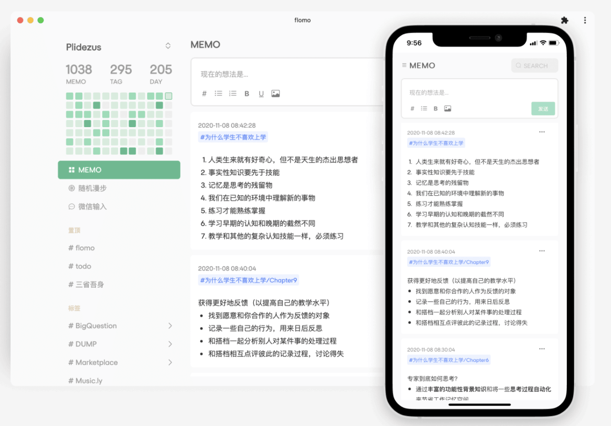

# 瑞幸的局中局 - 真科技周刊第四期

## 封面图

美国 · 帕萨迪纳 From <a href="https://camarts.app/D3n">@camarts</a>

日期 2019年7月17日 19:36 | 相机 Canon EOS 5D Mark II

## 文章

### 电商的战略性赔钱

过完年后，在短袖、T恤还没有刚需的时候，把成本30块钱的夏装9块9卖，用赔钱的低价先去把销量冲起来，再慢慢涨到19块9，成本能够覆盖了，等真正夏天来临的时候，店铺稳稳当当占据销量排行榜前列，再去卖39块9一件，不用花任何推广费，就获得了很多免费流量。一个夏天结束，可能卖几十万件、上百万件。而当初赔的那几十万，就相当于是廉价广告费了。底层逻辑都捋通之后，你就知道，原来电商是这么玩的。

[薇娅 适者生存](https://mp.weixin.qq.com/s/m9rnJt9_tZAPdE4FbKKg0g)

### 疫情之下，我卖掉了创业七年的公司

疫情期间，[Baremetrics](https://baremetrics.com/blog/i-sold-baremetrics) 的创始人四百万美元卖掉了创业七年打造的公司，文章作者讲述了他的创业经历，怎么一步步打造产品和团队，又是怎么和买家谈判，最终促成交易的。

[I sold Baremetrics（英文）](https://baremetrics.com/blog/i-sold-baremetrics)

### 瑞幸的局中局

我们都知道发布报告做空瑞幸的是一家美国空头基金 `浑水资本`，但浑水只是发布做空报告。那到底是谁制作并向美国空头提供了这样一个报告呢？

在 B站 UP 主 `半佛仙人` 最新的视频分析中，我们可以缕轻整个事件的轮廓：

首先，提供做空报告给浑水的是一家香港基金公司 雪湖资本。 报告的制作方是`雪湖资本` 委托的另外俩家咨询公司 `汇生咨询` 和 `久谦` 制作的。而这两家咨询公司其中的一家是 `大铮资本` 的供应商，为`大铮资本` 投资瑞幸，进行过融资尽职调查。“这就是左手帮做多方抱瑞幸大腿，右手帮做空方扒瑞幸底裤” 半佛仙人在视频中评论道。所以，瑞幸事件是铁三角其中一方被挖了墙角，背后一刀不讲武德。

[浑水做空YY，会不会成为下一个瑞幸](https://www.bilibili.com/video/BV1ya4y1p741)

### 2020 上海买房攻略

本文是作者在 2020年11月 在上海买房经历总结出来的买房购房做的一些功课。本着开源的精神，希望对大家也能有所帮助。启发来自这位同学2017年做的 [杭州购房分享](https://github.com/houshanren/hangzhou_house_knowledge)，本文也发布在Github[上海购房知识汇总](https://github.com/ayuer/shanghai_house_knowledge)，欢迎有兴趣的同学Star和发PR来共同维护。

[Shanghai House Knowledge](https://github.com/ayuer/shanghai_house_knowledge)

##  有意思的产品

### 川流 Flomo

无需标题、分类和排版，把对自己有启发的事情都记录下来，成为明日创造新知识的燃料。

###  Nutrio 智能切菜板

怎么用切菜板追踪个人饮食？Nutrio 智能切菜板自带了视觉、NFC 传感器，配合AI感应器可以识别出你放在切菜板上的是什么食物，并把这些食物记录下来、传到服务器 用配套 APP 就能追踪自己和家人的饮食习惯。切菜板表面可以单独拿下来清洗，有竹、山毛榉、胡桃木三种材质可选。

[Aurora Nutrio](https://www.aurora-nutrio.com/)

### Shower Power

可安装在任何喷头上的水力蓝牙淋浴扬声器。 它由可回收的海洋塑料制成，并利用水力发电机，可从水中产生100％的电力-提供无数小时的淋浴时间。

[Shower Power](https://www.kickstarter.com/projects/ampere/shower-power-waterproof-bluetooth-speaker-hydropower/?ref=producthunt)

### CSS Scan

CSS Scan Pro可以非常轻松地抓取您喜欢的网站的外观。 将鼠标悬停在任何元素上，即可立即获取其CSS、颜色、附件、动画、字体和尺寸。 使用直观的CSS编辑器复制，导出或优化它，而无需编写代码。

[CSS Scan](https://cssscanpro.com/)

## 言论

- 最应该记录的，不是「知识生产的素材」（即某种答案），而是「**对你造成极大触动的信息**」。
- 故事从随便一个日子里开始，又在随便一个日子里下落不明。 — 《繁花》
- 运气也是实力的一部分。 — 火影忍者
- 每一位个体的人生都是社会历史的一段插曲，后者为前者拉开序幕并会延续下去 —彼得·伯格(Peter Berger, 1969)

## 每周荐书

<a href="https://book.douban.com/subject/25764449/">《社会学的邀请》</a>

我们为什么会按照我们想的那样去做呢？我们为什么会按照我们做的那样去做呢？社会学旨在对这两个问题提供答案。尽管其他学科也试图做出回答，但社会学提供的分析视角，既有更大的包容性，又有更大的密切性，它比我们在许多其他领域可能找到的观点更为基本、更为明确。社会学可使我们洞悉“全景”。本书就是这样一本涵盖广泛、通俗生动的社会学入门书。

作者 / 译者：WittJ. / 林聚任

豆瓣评分：8.5分（888人评价）

[豆瓣书评](https://book.douban.com/review/5883031/) | [读书笔记](https://www.notion.so/9291528048d343f2946da84e1931b648)

## 图片

### 存储进化

### Mac最新操作系统的 ICON

### Camarts

Camarts 是作者的环球旅行摄影作品集。

[Camarts](https://camarts.app/H9c?w6)