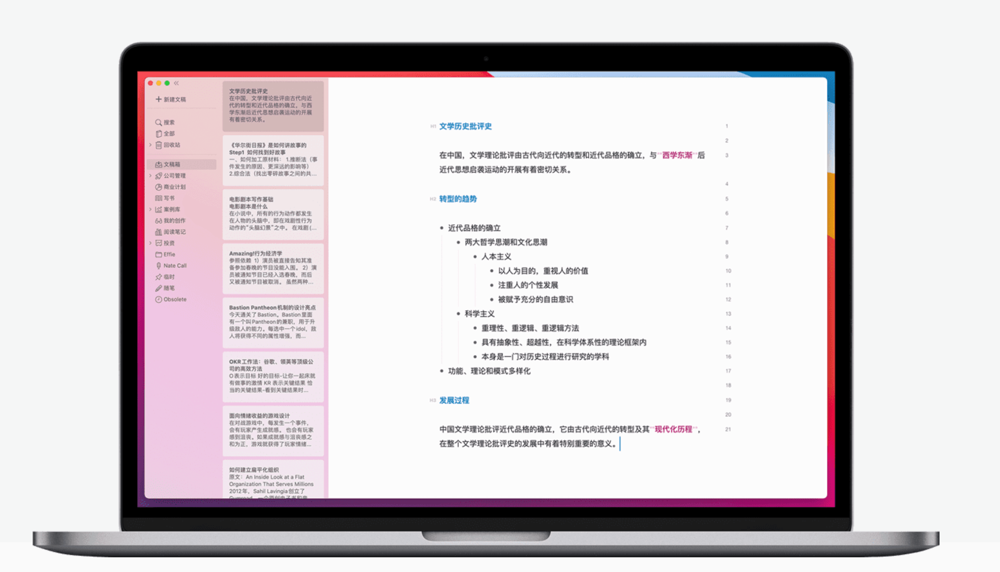
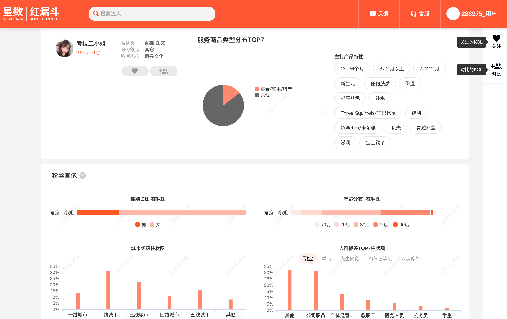

# 好生意的本质 真科技周刊第六期

封面图：航行在南极洲的铁板烧

 SONY ILCE-6500 | 24.0mm ƒ/2 1/160s

作者：<a href="https://unsplash.com/@rodlong">@rodlong</a>

### 工具软件设计哲学

工具是个联系使用者和设计者的桥梁。工具的设计者为解决一类问题而设计工具，工具的使用者也是为了解决一类问题而使用工具的。这两者对于工具都有自己的理解。工具的设计者通常会预测此工具会被用来解决怎样的问题，在设计工具时预见使用者的偏好，而工具的使用者则根据所面临的问题选择合适的工具。

关于工具软件中的一种作者称为：瑞士军刀，指的是像 Photoshop 之类的工具。通过巧妙的插件设计，讲一系列的小工具集成到一起实现解决某个特定领域问题的功能。

军刀工具的特点如下：

- 面向特定领域，覆盖该领域大部分问题
- 由领域专家设计，使用者需要了解该领域的基本知识才能熟练运用工具
- 内部由众多小模块组成，对外提供一致，简单的控制界面
- 常常具有强大的插件系统，以方便用户扩展现有系统

[阅读原文](https://blog.youxu.info/2012/02/02/software-tools-1/)

### 即便语言消失，智慧依然存在，古老知识永存

当我们短暂地逃避现实，躲进部落神秘、非凡的世界时，我们看到的不仅是希望，还有多个面向的真实，或许可以由此获得某种了悟，让人重拾力量，回溯内心。

文章推荐了基本对各地原始部落的人类学田野调查录。

[阅读原文](https://www.douban.com/note/652268528/)

### 无用的精英

***精英最重要的意义在于，他们会在需要的时候站起来表达自己的独立意见，即便这样的意见与政府态度相左。***

最近，财经作家吴晓波在接受财新的采访时说：“我觉得人大部分都是无用的，我是个精英主义者，我认为这个世界不需要那么多人去同时思考那么多问题。”

从吴晓波此前的文章中，我们大概可以猜出来：他的这个想法，来自被他称为偶像的美国记者沃尔特·李普曼（Walter Lippmann）。吴晓波曾这样总结李普曼的经典作品《舆论》...

[阅读原文](https://www.getrevue.co/profile/newslab/issues/027-679959)

### 吉列百年年报读后感：好生意的本质

生意与生意之间天生就有区别。就像小朋友，有的天资聪颖，不怎么读书就考满分、拿第一，一般的就要辛辛苦苦才能争得上游，而且一辈子可能还没有几次第一。

剃须刀就是一个非常好的生意。公司从成立后的 100 年间，总共融资 3.5 万美元，但是从成立到 2004 年利润累计 171 亿美元，分红了 84 亿美元，还有几十亿的回购。在这么高比例的分红和回购情况下，Gillette 在 2004 年还成长到了拥有 100 多亿美元销售，接近 20 亿利润的公司，而且还在成长。

作者认为，吉列能成为好本意本质在于亮点：

A. 客户愿意为细微的差异支付溢价。

B. 极高的壁垒。

[阅读原文](https://mp.weixin.qq.com/s/zEnhyhXgDnd2DISDgJrIng)

### 尊曹贬刘的《三国演义》

来自一席的一场演讲，作者认为，《三国演义》跟我们通常所认为的尊刘贬曹是不同的，书中并没有记载很多曹操真实做过的很多残忍事情，而对曹操的描写更像是一个货真价实的枭雄，而刘备则显得软弱无能，更像是无知无能的贤主。

虽然不见得认同作者的观点，但也为我们提供了一种与众不同的思考思路，就像作者说的那样：最容易过时的是观点，而事实永远新鲜。

[视频链接](https://www.youtube.com/watch?v=FVm4PrbhDac)

## 小众软件

### Effie - 把思想变成价值

沉浸创作，神闲意定，万籁收声天地静。 心无旁骛才能完成卓越的创作。Effie是激进的极简主义现场，没有主色调，空荡的写作区，设计即退让，让你忽略数位软件的表象，专注在创作本身。 不觉已春深，物我两相忘。

[了解更多](https://www.effie.co/)

### 红漏斗 - 淘宝渠道&达人分析平台

基于阿里巴巴消费大数据及百万级网红达人数据库，以“网红/达人/KOL”为切入点，聚焦内容营销转化数据的工具化数据产品。精准匹配商品、品牌、MCN机构、达人以及投放渠道，服务多元形态的品牌内容营销应用场景，用数据提升内容营销效果。登录后免费使用

[了解更多](https://www.cbndata.com/daren/dashboard)

## 一本书

### 2000年以来的西方

作者：刘擎  
豆瓣评分：8.4

在过去的十八年里，刘擎的“西方知识界重要事件综述”已经成为中国知识界辞旧迎新的保留曲目和年度大餐。 不同于阅后即焚的同主题媒体报道，刘擎的书写既有知识的积累，更有思想的沉淀。他尝试站在中国思考西方， 又从西方反观中国，在往返折冲之间不断地追问和求索。

在我看来，刘擎最难能可贵的地方在于思想的节制和平衡：视野开阔但绝不仅仅停留在表层上，不会因为过度自省而模糊立场，也不会因为同情心强大而丧失批评的力道，为汉语学界的公共写作确立了标杆。

—— 周濂

[了解更多](https://book.douban.com/subject/35373328/) | [书评：美国真的不行了吗？](https://book.douban.com/review/13497803/)

