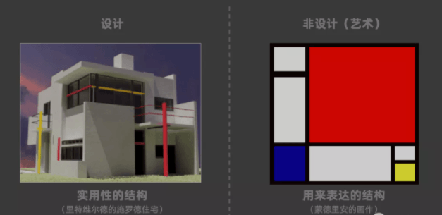
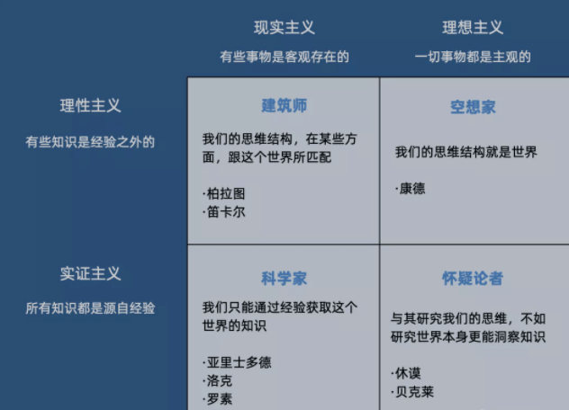

# 不用微信的人 - 真科技周刊第七期


<center>
封面图：意大利米兰街头的旅行纪念品商店
</center>

<center>
作者：<a href="https://unsplash.com/photos/wt2f53LDubA">@Christian Lue</a>
</center>

## 优质内容

### 六个半的设计哲学 from Alex

最近读到了 Musical.ly 联合创始人、Tik Tok 原负责人 Alex Zhu 的一份 PPT，应该是他在 SAP 工作时的分享。 读罢启发良多，把我的一些摘要整理出来，分享给大家

演讲首先提到设计与艺术的区别：

```
设计是通过 结构化 的解决方案，提升人类行为的 效用 。艺术可以没有任何实用性，但设计必须要实用性。建筑师是前者，因为做出的建筑要有人住；画家是后者，因为画作本身不具实用性
```




设计是对结构的设计，并不是对界面的设计、对美观的设计。一切设计都是实用性的，而不是单纯用来表达的

设计的流程是：定义任务 -> 设计故事 -> 设计界面。



设计时我们应该以哪种心态？

全都要。

我们应当用按顺序去调整自己的角色：
怀疑论者 -> 空想家 -> 建筑师 -> 科学家。

先是充满怀疑去面对用户和市场，面对问题，然后变成空想家，在想象力概括和抽象概念，寻求解决方案。接下来根据找到的方案，去实践和试错，建设起来。在建设的过程中，找到真正合理的方法和理念。

常见的情况是，很多人一直是空想家，只在发散，没有收敛，做的方案过于离散。有些人一直是怀疑论者，没有动手尝试。

中文：https://mp.weixin.qq.com/s/avYa-bzd-uEjIz6rQ4GG2A

英文原版：https://www.slideshare.net/mylonelyhouse/six-and-half-philosophies-for-design-innovation-presentation

### 创造新世界

本文作者是Alex Danco,  他在电子商务公司Shopify负责创新业务，也曾在 Social Capital 做过投资。

你可能听说过一条熟悉的职业建议：“每个人其实都在从事销售工作，即使他们没有意识到这一点。”  这是一个很好的建议。

我想提出一个适合今天的更新版本：“每个人的工作都是创造新世界，即使他们没有意识到这一点。”

这两个版本差不多是相同的意思，但后者更适合一个充满丰富叙事和复杂选择的世界。你想销售的东西越复杂或越有价值，围绕这个想法建立起一个新世界对你来说就越重要。在这个世界里，其他人可以走进来、探索和玩乐，而你不用一直留在那里看陪着他们。你需要建立一个非常丰富和迷人的世界，以至于其他人在你不在的时候也愿意花很多时间在那里。

学习到如何做到这一点需要时间积累。在你职业生涯的早期，你被要求完成的任务通常是简单的和单线程的，或者针对一个特定的问题。但随着你的成长并承担更艰巨的责任，或者放手一搏尝试将自己的想法带入到这个世界，你会很快发现世界上真正值得努力解决的难题都是系统性问题。试图在大公司内部做创新？你面对的是系统性问题。试图建立一家创业公司用有趣的方式重塑世界？这也是一个系统性问题。媒体、政治或任何涉及杠杆的追求都是如此...

中文：https://mp.weixin.qq.com/s/bRqWb2-zI5j5_sGsvVOmwA

英文：https://alexdanco.com/2021/04/10/world-building/

### “副业”正在成为年轻人的新刚需

麦肯锡全球研究院（MGI）发布报告《后疫情时代经济之未来的工作》指出，疫情加速了消费者行为和业务模式方面的三大转变：远程工作增加、电商和线上互动接受度提升、自动化和人工智能技术部署加速。这三大转变均将产生不同程度的长期影响。与此同时，这些趋势也将在未来十年加速重塑包括中国在内的全球主要经济体的就业结构...

https://mp.weixin.qq.com/s/oTtqc7ZBrMtJOOXEyYiqPA

### 不用微信的人

今年初，微信创始人张小龙披露了一组关于微信使用的数据——每天有10.9亿用户打开微信，有7.8亿用户进入朋友圈，1.2亿用户发布朋友圈。每天，有6.7亿张照片、1亿条短视频被上传到朋友圈。点开这个绿色的APP，可以在里面完成社交、娱乐、消费等一系列日常行为。这个崛起于2011年的社交软件，已经统治了我们绝大部分人的日常。

《人物》编辑部由此提出一个问题：那些不用微信的人，是如何度过他们的每一天呢？

《人物》和几位不用微信的人聊了聊，收集了他们的故事，或许并不全面，但是他们逃离微信的理由，以及如何生活的故事，或许能给你带来一点小的启发。我们的目的，是希望在这种「个人难以相敌」的系统中，你能有机会，找到让自己愉快的表达自由...

[原文](https://mp.weixin.qq.com/s/BcYAJ95Pub3HQKXNF8XTLw)

### JSONServer

零代码三十秒搭建 RESTFUL API 接口服务 (认真的)

[原文](https://github.com/typicode/json-server)

### 本故事纯属非虚构

来自一席的一篇演讲，演讲者用五个小人物在人生中跌宕起伏的故事，为我们讲述了在时代大潮压向这些小人物的他们的无力，只能随波漂浮在命运的洪流中接受命运的安排。

[原文](https://www.youtube.com/watch?v=unQJyn4Mzg4)


### 塔利班为什么要炸掉巴米扬大佛

2000年阿富汗发生了全国性的大水，导致粮食大规模减产，塔利班向全球发出求助，呼吁大家来支援阿富汗的粮食和经费，但因为塔利班过去的所作所为导致没有多少国际组织来援助，塔利班为了报复国际组织，研究了半天决定把巴米扬大佛炸了。全球几个重要的博物馆、文物保护机构和联合国科教文组织就写了一封联名信，谴责塔利班的行为。

塔利班用一种非常挑衅的语气回应，我们国家的活人挨饿你们不帮忙，现在不过炸掉了一个佛像就开始批评了，可见西方虚伪的嘴脸。但它这封公开信的语气，给人感觉好像阿富汗不是塔利班在治理，好像塔利班对阿富汗的饥荒粮食短缺没有责任似的，但是塔利班就是觉得自己没有责任，它觉得这是天灾，你们应该帮助我，你们不帮我就让你们不爽。

[原文](https://mp.weixin.qq.com/s/hyEKWfKW9FNMEpdPBXsmIA)

## 小众软件

### BoardOS 在线实时白板写作系统

「BoardOS」是基于白板的在线实时协作系统，拥有多种扩展应用和插件，适用于团队协作、线上教学、在线会议、头脑风暴、在线设计等众多场景，一切为了高效！整个系统基于插件机制的设计，可以把各种功能封装成白板内的App或插件，这样使得BoardOS有无限的扩展可能。


[官网](https://boardos.online/)

### 助聊 - 大数据教你怎么撩妹

海量聊天话术，撩妹资讯，撩妹秘籍。让妹子深深的被你吸引住。


使用方式，微信搜索 [助聊] 小程序

## 一本书

### 党员、党权与党争


作者：王奇生 <br/>
豆瓣评分: 9.2

本书考察国民党的组织形态，从国民党内部探寻其制度结构与运作机制，对国民党内部派系冲突、党务与党权在地方的运作、党与政和军的关系等做了细致的讨论。全书核心是国民党为“弱势独裁政党”，其组织的散漫性使其无法实现俄共式的一党专政，即有独裁之心而无独裁之力。作者指出，国民党始终未能建立一个具有严密渗透性和强大内聚力的政党组织体系，这是其最终失去政权的主要原因。

[豆瓣链接](https://book.douban.com/subject/5372471/) ｜ [书评](https://book.douban.com/review/1614112/)