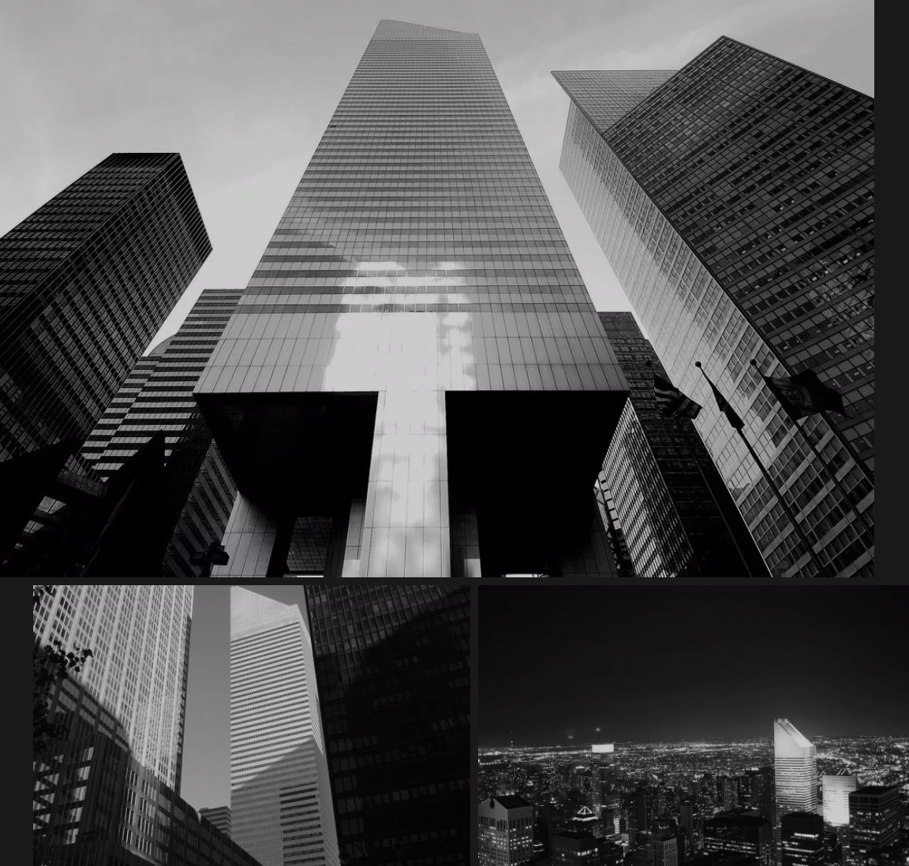
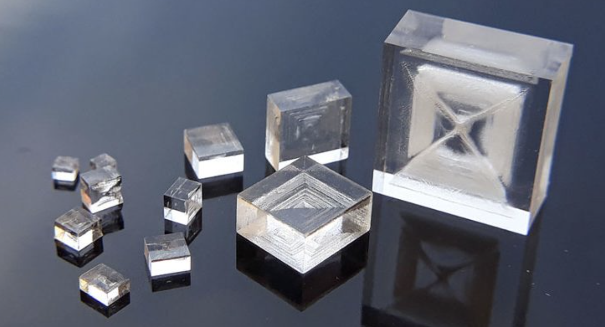
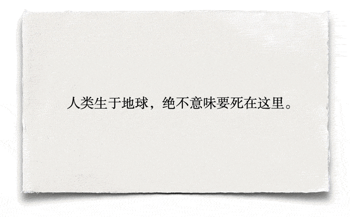
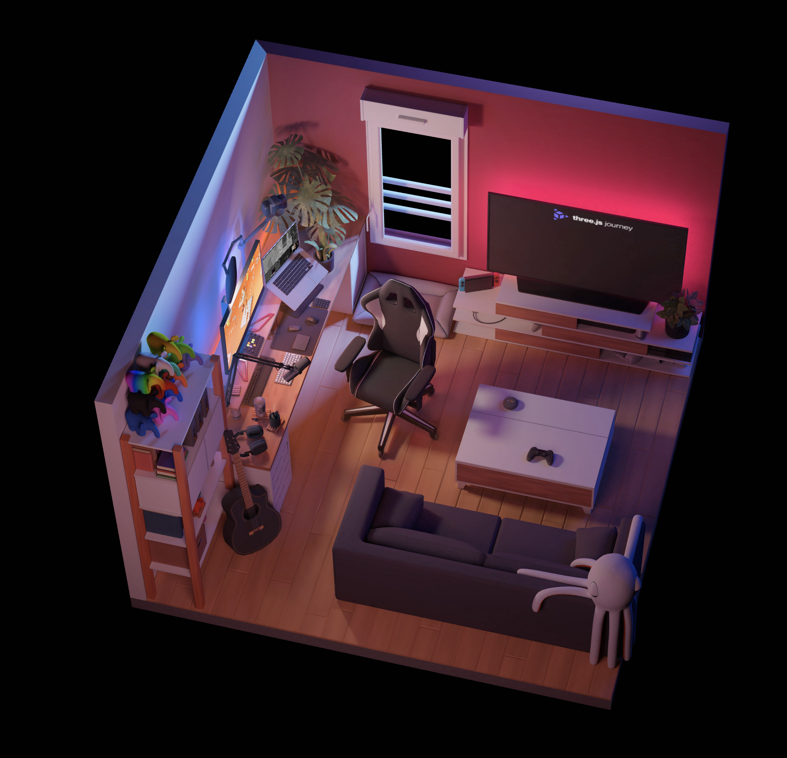
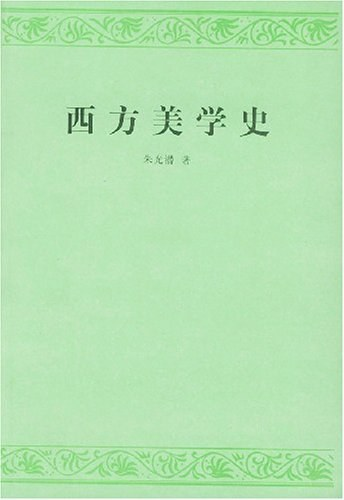

# 真科技周刊

封面图：龙卷风后，肯塔基州当地的电影院

[来源：Reddit](https://www.reddit.com/r/pics/comments/rfwd9y/pics_i_took_from_the_tornado_destruction_in/?utm_source=share&utm_medium=web2x&context=3)

## 优质内容

### 一人公司方法论

作者把一人公司定义为：建立在个人品牌至上的公司。即整个公司的业务和品牌影响力主要源于一个人，可能有一些辅助运营的团队、外包货兼职，但归根结底也是一人公司。作者总结了一些运营一人公司的常见方法。

 [来源](https://github.com/easychen/one-person-businesses-methodology)

### 史上最严重的十大建筑事故

作者总结了史上最严重的十大建筑设计事故的原因和解决方法，包括：孟加拉国萨瓦区大楼倒塌事件、花旗集团中心结构事件、华特迪斯尼音乐厅、卡托维兹贸易大厅屋顶倒塌、上海莲花河畔景苑倒塌事故、Kemper体育馆倒塌事故、约翰.汉考克大厦、维达拉温泉酒店、新世界酒店、美国银桥、

令我惊讶的是在这些设计事故里，不乏知名设计师如弗兰克·盖里、Rafael Viñoly、贝聿铭，其中有一些大楼在竣工之前，还获得过设计大奖。

https://mp.weixin.qq.com/s/fD-VQU8K3wQ5EtWBvsrSaw

### 如何在家自制氯化钠晶体

文章描述了个人如何在家用家用设备制作完美的氯化钠晶体，其中 "Temperature differences cause imperfections." 让我想起了绝命毒师中老白对于温度的苛刻要求。

[How to Grow Sodium Chloride Crystals at Home](https://crystalverse.com/sodium-chloride-crystals/)

### 那些免费的砖

https://www.thosefree.com/

### freepik

免费可商用！提供高质量的图片、矢量图和 psd 文件的素材网站

[freepik](https://www.freepik.com/?from=thosefree.com)

### 你知道吗？构图的奥秘很简单！

偶然看到这篇讲视觉重力的文章，感觉有很大触动。在之前我理解的设计追求的是一致性，所谓"艺术是让东西看起来不一样，设计是让所有东西看起来都一样"。如果你在这里的标题用了26号字，那么请在那里的标题也用同样大小的字。而视觉重力告诉我们，我们做到像素级别的一致很简单，但问题在于我们的大脑在处理各种不同的图形、颜色、形状 并不是一致的，绝对的居中可能会导致视觉上的不居中。面对有些元素就是要差别对待才能保证我们视觉上的一致性、平衡性。 

[来源](https://www.zcool.com.cn/article/ZMTI5MTIxMg==.html)

### 3D展示我的房间

[3D Room](my-room-in-3d.vercel.app)

## 言论

- 最好的程序员不是善于编写复杂代码，而是有能力为复杂的问题提出简单的解决方案。只有糟糕的程序员，才会对简单的问题提出复杂的解决方案。 -- Hacker News 用户
- 网络效应是事情的开端，但规模经济使车轮不断旋转。 Network effects started things off, but economies of scale kept the wheels spinning. —— Rubinstein
- 行不尽，行不尽，一路青山 —— 种田山头火
- “艺术评论家聚在一起谈论的是形式、结构和意义，而艺术家们在一起讨论在哪里可以买到便宜的松节油。” —— 毕加索
- 对于跨境电商这场比赛的胜出者来说，奖牌上刻的不是更好的“跨境卖家”，而是真正的“全球化品牌” —— 刘润

### 一本书：西方美学史

作者：朱光潜 ｜ 豆瓣评分：8.7

一部有着浓厚特定历史时期气质的讨论西方美学的教科书，从柏拉图到康德，走过古希腊、中世纪、文艺复兴、到近现代西方美学思想发展。

所选择的主要流派中代表人物是以“影响较为深远，公认为经典性”为原则，来说明历史发展线索；在对每一位美学家的评述，也是先介绍总的时代背景和思想渊源，再分析和评价其具体美学观点，总结其得失，在美学领域具有很高的价值。